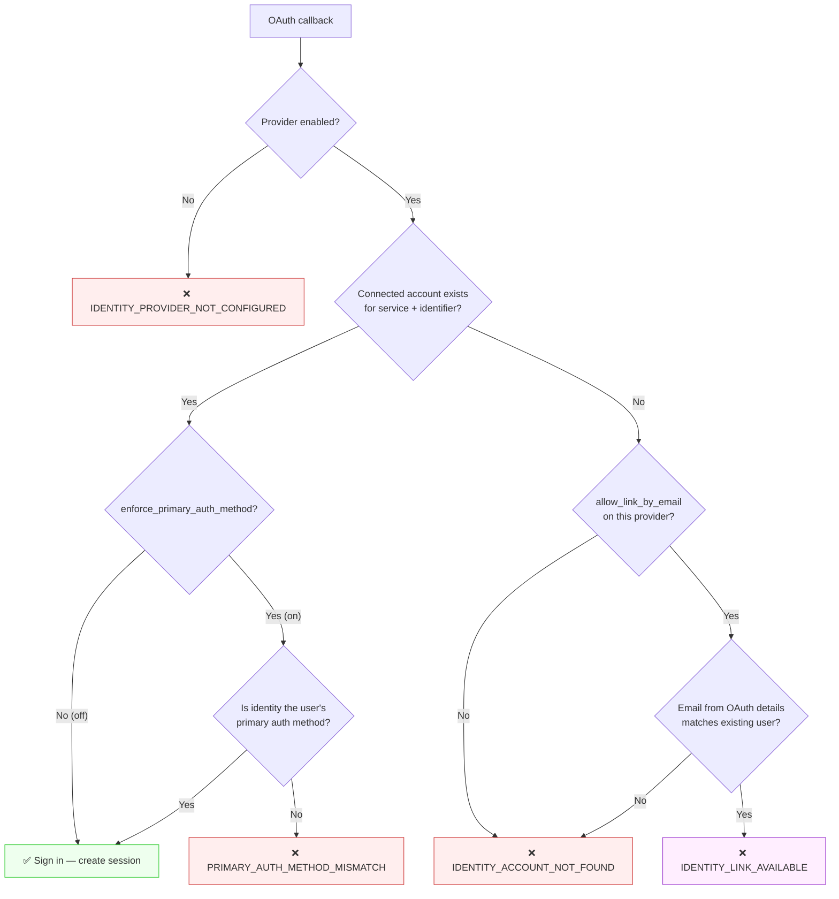
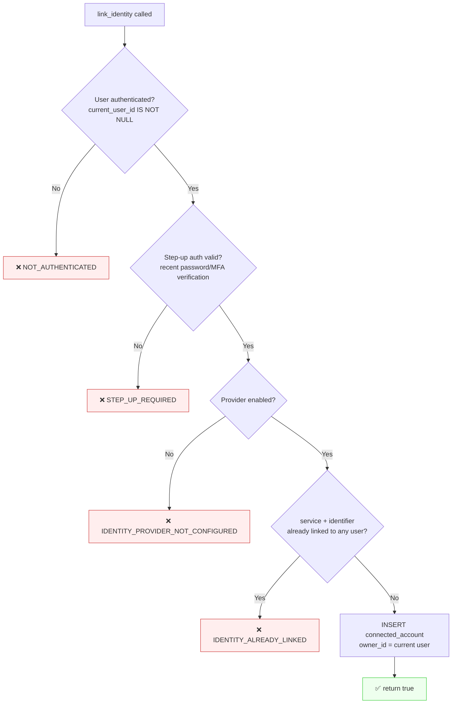
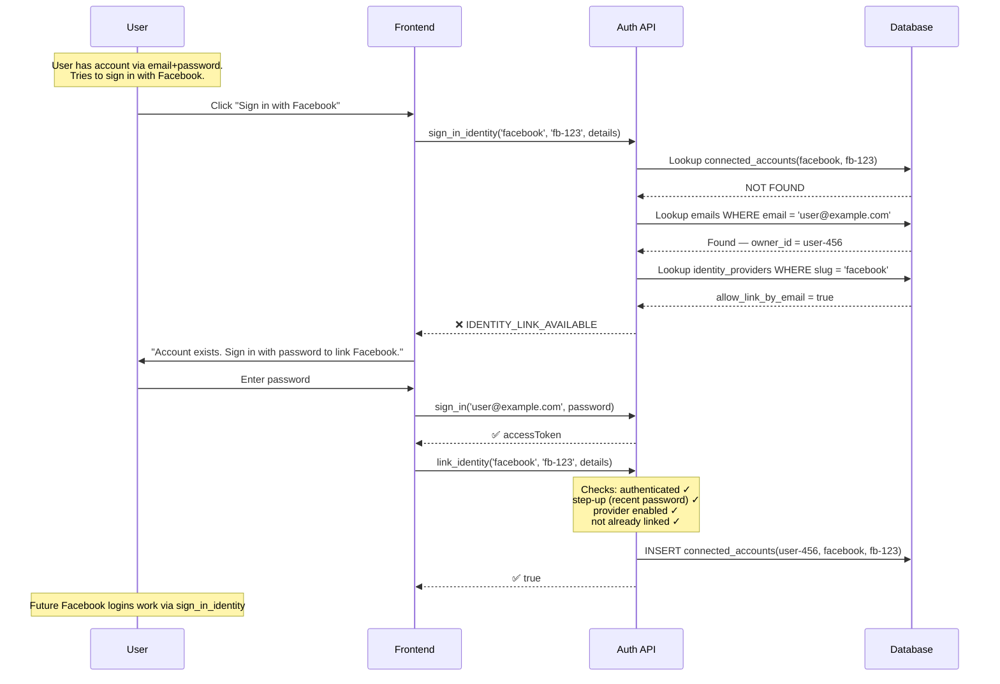
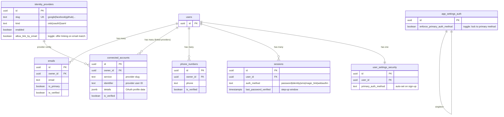

# Identity Linking & Account Collision Resolution

## Overview

Identity linking lets users attach multiple auth providers (Google, Facebook, GitHub, phone, password) to a single account. One method is **primary** (creates sessions), the rest are **linked** (connected but don't sign in by default).

Two toggles control the system:

| Toggle | Scope | Default | Effect |
|--------|-------|---------|--------|
| `allow_link_by_email` | Per identity provider | `false` | When an unknown OAuth identity's email matches an existing user, offer linking instead of failing |
| `enforce_primary_auth_method` | App-wide (`auth_settings`) | `true` | Only the user's primary auth method can create sessions |

## Sign-In Identity Flow (OAuth Callback)

When a user signs in with an OAuth provider, `sign_in_identity(service, identifier, details)` runs this decision tree:



### Error code summary

| Error | Meaning | Frontend action |
|-------|---------|----------------|
| `IDENTITY_PROVIDER_NOT_CONFIGURED` | Provider slug doesn't exist or is disabled | Show "provider unavailable" |
| `PRIMARY_AUTH_METHOD_MISMATCH` | User's primary method is different (e.g. password) | Prompt to sign in with primary method |
| `IDENTITY_ACCOUNT_NOT_FOUND` | No account linked and no email match (or linking disabled) | Redirect to sign-up |
| `IDENTITY_LINK_AVAILABLE` | Email matches an existing account — linking is possible | Prompt: "Sign in with your existing method to link this provider" |

## Link Identity Flow (Attach Provider to Existing Account)

After the frontend receives `IDENTITY_LINK_AVAILABLE`, the user signs in with their existing method, then calls `link_identity(service, identifier, details)`:



## End-to-End Linking Scenario



## Data Model



## Configuration

### Enable linking for a provider

```sql
-- Allow Google sign-ins to offer linking when email matches existing account
UPDATE auth_private.identity_providers
SET allow_link_by_email = true
WHERE slug = 'google';
```

### Disable primary auth enforcement (allow any linked method to sign in)

```sql
UPDATE auth_private.app_settings_auth
SET enforce_primary_auth_method = false;
```

## SDK Usage

```typescript
import { createClient as createAuthClient } from '@constructive-db/sdk/auth';

const auth = createAuthClient({ endpoint });

// 1. Try OAuth sign-in
try {
  const result = await auth.mutation.signInIdentity({
    input: { service: 'facebook', identifier: fbUserId, details: fbProfile }
  }).execute();
  // Success — user is signed in
} catch (err) {
  if (err.message.includes('IDENTITY_LINK_AVAILABLE')) {
    // 2. Prompt user to sign in with existing method
    const signIn = await auth.mutation.signIn({
      input: { email, password }
    }).execute();

    // 3. Link the new provider
    await auth.mutation.linkIdentity({
      input: { service: 'facebook', identifier: fbUserId, details: fbProfile }
    }).execute();
    // Facebook is now linked — future logins work
  }
}
```
